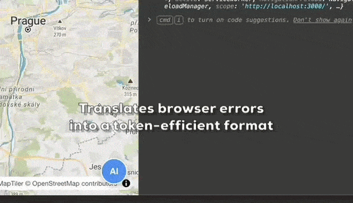

# AI-SlimTrace 🚀

**Token-efficient Error Trace for AI Agents**


AI-SlimTrace is a lightweight Chrome extension that translates chaotic browser errors into a concise, token-efficient format designed specifically for LLMs.

> ### 📦 [**Download Ready-to-Use Package (ZIP)**](dist/ai-slimtrace-v1.0.zip)
> *For quick installation without cloning the entire repository.*

---

### 💎 The Killer Feature
> **Save up to 88% of your tokens** by stripping away framework noise, redundant stack traces, and system-level garbage. Keep your AI context window focused on your code, not your tooling.



---

## Why AI-SlimTrace?

When debugging with AI, raw stack traces are:
1. **Token Hogs**: Consuming thousands of tokens on repetitive source maps and `node_modules`.
2. **Noisy**: Filled with internal Vite/Webpack logic and deep browser internals.
3. **Redundant**: React often logs the same error 3x in different formats.

**AI-SlimTrace fixes this.** It provides a "One-Click Debug" button that captures exactly what the agent needs to see.

## Features

- 🧹 **Clean Stack Traces**: Automatically removes `node_modules`, Vite internal scripts, and Chrome extension noise.
- 📉 **Token Optimization**: Limits stack depth and removes cache-busting timestamps (`?t=...`).
- 🔗 **Smart URL Shortening**: Converts long local URLs to concise paths (e.g., `src/App.jsx:50`).
- ⚛️ **React-Aware**: Filters out common React component wrappers from the component stack.
- 🚦 **Context-Aware SPA Support**: Detects navigation in Single Page Applications (React, Vue) and preserves error history. The visual indicator dynamically reflects the state of the *current* page.
- 🚨 **Visual Indicators**: The floating AI button pulses red when an error or warning is detected on your current page.
- 🔒 **Privacy Focused**: By default, only activates on `localhost` and `127.0.0.1`. You can easily add your own local or staging domains in `config.js`.

## Quick Start

### Installation

1. [**Download the ZIP**](dist/ai-slimtrace-v1.0.zip) and extract it, or clone this repository.
2. Open Chrome and navigate to `chrome://extensions/`.
3. Enable **Developer mode** (toggle in the top right).
4. Click **Load unpacked** and select the extracted `ai-slimtrace` folder.

### Usage

1. Open your local project (e.g., `http://localhost:3000`).
2. You'll see a subtle **AI** button in the bottom right corner.
3. When an error occurs, the button will pulse red and turn into **AI!**.
4. Click the button to copy the cleaned debug snapshot to your clipboard.
5. Paste it to your AI agent.

## Output Example

**Before (Raw DevTools):**
```text
MUI Grid: The `item` prop has been removed and is no longer necessary. You can safely remove it.

(anonymous) @ inject.js:60
(anonymous) @ chunk-XD4ZNJ5F.js?v=80c3a6fe:8296
deleteLegacyGridProps @ chunk-XD4ZNJ5F.js?v=80c3a6fe:8293
Grid3 @ chunk-XD4ZNJ5F.js?v=80c3a6fe:8367
react-stack-bottom-frame @ react-dom_client.js?v=80c3a6fe:17424
renderWithHooks @ react-dom_client.js?v=80c3a6fe:4206
updateForwardRef @ react-dom_client.js?v=80c3a6fe:6461
beginWork @ react-dom_client.js?v=80c3a6fe:7864
runWithFiberInDEV @ react-dom_client.js?v=80c3a6fe:1485
performUnitOfWork @ react-dom_client.js?v=80c3a6fe:10868
workLoopConcurrentByScheduler @ react-dom_client.js?v=80c3a6fe:10864
renderRootConcurrent @ react-dom_client.js?v=80c3a6fe:10844
performWorkOnRoot @ react-dom_client.js?v=80c3a6fe:10330
performWorkOnRootViaSchedulerTask @ react-dom_client.js?v=80c3a6fe:11623
performWorkUntilDeadline @ react-dom_client.js?v=80c3a6fe:36
<ForwardRef(Grid3)>
exports.jsxDEV @ react_jsx-dev-runtime.js?v=80c3a6fe:250
Profile @ Profile.jsx:180
react-stack-bottom-frame @ react-dom_client.js?v=80c3a6fe:17424
renderWithHooks @ react-dom_client.js?v=80c3a6fe:4206
updateFunctionComponent @ react-dom_client.js?v=80c3a6fe:6619
beginWork @ react-dom_client.js?v=80c3a6fe:7613
runWithFiberInDEV @ react-dom_client.js?v=80c3a6fe:1485
performUnitOfWork @ react-dom_client.js?v=80c3a6fe:10868
workLoopConcurrentByScheduler @ react-dom_client.js?v=80c3a6fe:10864
renderRootConcurrent @ react-dom_client.js?v=80c3a6fe:10844
performWorkOnRoot @ react-dom_client.js?v=80c3a6fe:10330
performWorkOnRootViaSchedulerTask @ react-dom_client.js?v=80c3a6fe:11623
performWorkUntilDeadline @ react-dom_client.js?v=80c3a6fe:36
<...>
exports.jsxDEV @ react_jsx-dev-runtime.js?v=80c3a6fe:250
App @ App.jsx:68
react-stack-bottom-frame @ react-dom_client.js?v=80c3a6fe:17424
renderWithHooks @ react-dom_client.js?v=80c3a6fe:4206
updateFunctionComponent @ react-dom_client.js?v=80c3a6fe:6619
beginWork @ react-dom_client.js?v=80c3a6fe:7654
runWithFiberInDEV @ react-dom_client.js?v=80c3a6fe:1485
performUnitOfWork @ react-dom_client.js?v=80c3a6fe:10868
workLoopSync @ react-dom_client.js?v=80c3a6fe:10728
renderRootSync @ react-dom_client.js?v=80c3a6fe:10711
performWorkOnRoot @ react-dom_client.js?v=80c3a6fe:10330
performWorkOnRootViaSchedulerTask @ react-dom_client.js?v=80c3a6fe:11623
performWorkUntilDeadline @ react-dom_client.js?v=80c3a6fe:36Understand this warning
inject.js:60 MUI Grid: The `xs` prop has been removed. See https://mui.com/material-ui/migration/upgrade-to-grid-v2/ for migration instructions.
```

**After (AI-SlimTrace):**
```text
Log @ localhost:3000/profile
@ /profile
W: (Array.forEach (<anonymous>)) MUI Grid: The `item` prop has been removed and is no longer necessary. You can safely remove it.
W: (Array.forEach (<anonymous>)) MUI Grid: The `xs` prop has been removed. See https://mui.com/material-ui/migration/upgrade-to-grid-v2/ for migration instructions.
```
> 📉 **Token Compression: 88% smaller**  
> *(Calculated from this specific real-world scenario: ~600 tokens reduced to ~70 tokens).*

### SPA Context Awareness

When navigating between pages in a React/Vue application, AI-SlimTrace automatically organizes logs by the page they occurred on. This allows your AI agent to understand the full user journey and history leading up to the current error:

```text
Log @ localhost:3000/editroute

@ /profile
W: (Array.forEach (<anonymous>)) MUI Grid: The `item` prop has been removed and is no longer necessary. You can safely remove it.

@ /editroute
E: ReferenceError: TerrainIcon is not defined
EditRoute (components/sections/EditRoute.jsx:1281:47)
```

## Configuration

You can customize the extension behavior in `config.js`. 

### Managing Allowed Domains
By default, the extension only activates on `localhost`, `127.0.0.1`, and `0.0.0.0`. To add a new domain (e.g., a staging server):

1.  **Update `config.js`**: Add your domain to the `allowedDomains` array.
    ```javascript
    allowedDomains: ['localhost', '127.0.0.1', 'staging.my-app.test']
    ```
2.  **Update `manifest.json`**: Add the matching pattern to the `matches` array in `content_scripts`.
    ```json
    "matches": ["http://localhost/*", "http://staging.my-app.test/*"]
    ```

### Other Settings (in `config.js`)
- `maxLogs`: Number of recent logs to keep in the buffer (default: 20).
- `pulseOnError`: Set to `false` to disable the red pulsing animation when an error is detected.

## License

MIT
